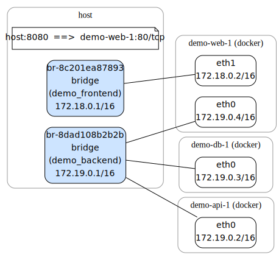
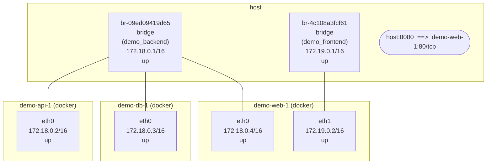

# vnetviz  

**Visualize Linux virtual network topologies**   
including network namespaces, veth pairs, bridges, Docker, and Podman networks.

## Why ?
### The Problem
Linux networking can quickly become complex when network namespaces, veth pairs, bridges, Docker, and Podman networks are combined. 

Understanding the topology often requires manually correlating the outputs of commands such as `ip link`, `ip netns`, `bridge`, `docker`, and `podman`. This quickly becomes tedious and error-prone as environments grow.

### The Solution
`vnetviz` automatically discovers these relationships and renders them as:

<!-- - diagrams
  <p align="left">
    
  </p> -->

- Diagrams (Mermaid / SVG / PNG)


- Text tree
  ```
  $ sudo vnetviz 
  host
  ├─ br-8c201ea87893  [bridge]  (demo_frontend)  172.18.0.1/16  up
  │　└─ veth6dfa4c8  ==( veth )==  eth1  @demo-web-1 (docker)  172.18.0.2/16  up
  ├─ br-8dad108b2b2b  [bridge]  (demo_backend)  172.19.0.1/16  up
  │　├─ vetha70dea7  ==( veth )==  eth0  @demo-api-1 (docker)  172.19.0.2/16  up
  │　├─ vethf03dc6c  ==( veth )==  eth0  @demo-db-1 (docker)  172.19.0.3/16  up
  │　└─ veth62b5a80  ==( veth )==  eth0  @demo-web-1 (docker)  172.19.0.4/16  up
  └─ host:8080  ==>  demo-web-1:80/tcp

  demo-web-1 (docker)
  ├─ eth0  ==( veth )==  veth62b5a80  @host  172.19.0.4/16  up
  └─ eth1  ==( veth )==  veth6dfa4c8  @host  172.18.0.2/16  up

  demo-db-1 (docker)
  └─ eth0  ==( veth )==  vethf03dc6c  @host  172.19.0.3/16  up

  demo-api-1 (docker)
  └─ eth0  ==( veth )==  vetha70dea7  @host  172.19.0.2/16  up

  ```

## Features

- Detect network namespaces
- Detect veth peer relationships
- Detect bridges, bonds, and VLANs
- Docker / Podman support
- Export to Mermaid / Graphviz (DOT/SVG/PNG)
- ASCII output

## Supported platforms

- **OS:** Linux only — vnetviz reads live network state via netlink and enters
  namespaces with `setns`, so it does not run on macOS or Windows.
- **Architectures:** `amd64` (x86_64) and `arm64` (aarch64); these are the
  prebuilt binaries published on GitHub Releases.
- **Privileges:** root (e.g. via `sudo`) is typically required to enter other
  network namespaces and containers; without it vnetviz still renders what it can
  reach and tells you when to re-run with `sudo`.
- **Optional dependencies:**
  - [Graphviz](https://graphviz.org/) (`dot`) — only for the `svg` and `png`
    formats; the text, unicode, ascii, mermaid and dot formats need nothing extra.
  - the `docker` / `podman` CLI — only for container discovery (skipped silently
    when absent).

## Install

### One-liner  
The install directory depends on how you run it.

- System-wide as root (via `sudo`), into `/usr/local/bin`:

  ```bash
  curl -fsSL https://raw.githubusercontent.com/vz-shark/vnetviz/main/install.sh | sudo sh
  ```

- Just for your user (no root), into `~/.local/bin`:

  ```bash
  curl -fsSL https://raw.githubusercontent.com/vz-shark/vnetviz/main/install.sh | sh
  ```

- The script never calls `sudo` on its own; if the chosen directory needs
privileges it doesn't have, it just tells you to re-run with `sudo`. Override the
location with `VNETVIZ_BIN_DIR`:

  ```bash
  curl -fsSL https://raw.githubusercontent.com/vz-shark/vnetviz/main/install.sh \
    | VNETVIZ_BIN_DIR="$HOME/bin" sh
  ```

- Pin a version with `VNETVIZ_VERSION` (e.g. `VNETVIZ_VERSION=v0.1.0`).


### Prebuilt binaries
- Available from the GitHub Releases page:
[https://github.com/vz-shark/vnetviz/releases](https://github.com/vz-shark/vnetviz/releases)


## Usage
> **Note**  
> To inspect network namespaces and containers, `vnetviz` typically needs to run as root.


```bash
# text tree to stdout, with the defaults: the virtual topology (bridges, veth,
# VLANs, netns and containers, but not the host's physical NICs), IP addresses
# shown, veth pairs collapsed, and down interfaces hidden
# (root is needed to enter other namespaces)
sudo vnetviz

# Mermaid to stdout
sudo vnetviz --format mermaid

# Mermaid to a Markdown file: wrapped in a ```mermaid fence so it renders
# inline on GitHub
sudo vnetviz --format mermaid -o diagram.md

# Graphviz DOT, everything enabled, to a file -> render with dot
sudo vnetviz --format dot --all --output net.dot
dot -Tsvg net.dot -o net.svg

# SVG / PNG directly (vnetviz shells out to Graphviz `dot` for you)
sudo vnetviz --format svg --all --output net.svg
sudo vnetviz --format png --all --output net.png
```

If vnetviz finds network namespaces (named netns or containers) it cannot enter
because it is not running as root, it prints an error on stderr suggesting how to
re-run under `sudo` and exits non-zero (no partial diagram is produced):

```text
vnetviz: cannot read 1 namespace(s) without root: vztest
         re-run with: sudo vnetviz
```

The message is colored yellow only when stderr is a terminal, so piped or
redirected output stays plain.

The `svg` and `png` formats require [Graphviz](https://graphviz.org/) (`dot`)
on your `PATH`; vnetviz generates the DOT internally and pipes it through
`dot -Tsvg` / `dot -Tpng`. When `--output` is omitted the diagram is written to
standard output (`png` to a terminal is refused — use `--output`).

The default `text` format prints a compact, `tree(1)`-style tree, readable
straight in the terminal:

```text
host
├─ br-9f3a21  [bridge]  (appnet)  172.18.0.1/16  up
│　├─ eth0  @web (docker)  172.18.0.2/16  up
│　└─ eth0  @db (docker)  172.18.0.3/16  up
└─ host:8080  ==>  web:80/tcp
```

A bridge backed by a Docker/Podman network shows that network's friendly name in
parentheses (`(appnet)` above), and a published port appears as a self-contained
`host:<port>` node. Run with `--all` to also include the host's physical NICs,
loopback, and operationally-down interfaces.

Like `tree(1)`, the default `text` format picks its line-drawing characters
from the locale: a UTF-8 locale gets Unicode connectors, otherwise it falls back
to ASCII (so `LANG=C vnetviz` looks like `tree --charset=ascii`). Use `--format
unicode` or `--format ascii` to force one regardless of locale:

```text
host
|-- br-9f3a21  [bridge]  (appnet)  172.18.0.1/16  up
|   |-- eth0  @web (docker)  172.18.0.2/16  up
|   `-- eth0  @db (docker)  172.18.0.3/16  up
`-- host:8080  ==>  web:80/tcp
```

Each interface ends with its operational state (`up` / `down`). A down
interface has its whole row dimmed gray when the output goes to a terminal;
piped or redirected output stays plain. In `mermaid` output the state is shown
by the `up` / `down` label only (no custom color, so it reads in both light and
dark themes); in `dot` output down nodes are grayed and the word is omitted.

By default veth pairs are collapsed: the veth node is folded away and the bridge
links straight to each container interface (`br-9f3a21 -> eth0 @web`, as in the
trees above). Use `--detail on` to show the individual veth interfaces instead:

```text
host
├─ br-9f3a21  [bridge]  (appnet)  172.18.0.1/16  up
│　├─ veth9a1  ==( veth )==  eth0  @web (docker)  172.18.0.2/16  up
│　└─ vethb22  ==( veth )==  eth0  @db (docker)  172.18.0.3/16  up
└─ host:8080  ==>  web:80/tcp
```

### Options

Named netns and Docker/Podman containers — with container names, bridge network
names, and published-port nodes — are always detected (a missing container CLI
is skipped silently). The scope/display toggles below each take an explicit
`on` or `off` value (e.g. `--ip off`, `--physical on`); leaving a flag off the
command line keeps its default. `--all` turns every toggle on at once, but any
toggle you set by hand still wins (e.g. `--all --ip off`).

| Category | Option | Default | Description |
|---|---|---|---|
| Format | `--format text` | (default) | text tree, charset auto-selected from locale |
|  | `--format unicode` | | text tree, forced Unicode line drawing |
|  | `--format ascii` | | text tree, forced ASCII (`tree --charset=ascii`) |
|  | `--format mermaid` | | Mermaid output |
|  | `--format dot` | | Graphviz DOT output |
|  | `--format svg` | | SVG image (requires Graphviz `dot`) |
|  | `--format png` | | PNG image (requires Graphviz `dot`) |
|  | `-f` | | shorthand for `--format` |
| Output | `--output FILE` | | write to FILE instead of stdout |
|  | `-o FILE` | | shorthand for `--output` |
| Scope | `--virtual on\|off` | `on` | show virtual devices (veth, bridges, bonds, VLANs, ...) |
|  | `--lo on\|off` | `off` | show loopback interfaces |
|  | `--physical on\|off` | `off` | show physical NICs |
|  | `--all` | | turn every toggle on; per-flag `on\|off` still takes precedence |
| Display | `--ip on\|off` | `on` | show IP addresses |
|  | `--detail on\|off` | `off` | show interfaces in full detail (expand collapsed veth pairs) |
|  | `--upped on\|off` | `on` | show operationally-up interfaces |
|  | `--downed on\|off` | `off` | show operationally-down interfaces |
| Misc | `--version` | | print version and exit |

## How it works

* Interfaces and addresses are read with netlink (`vishvananda/netlink`).
* Namespaces are discovered from `/run/netns` (named) and from
  `/proc/<pid>/ns/net` for running Docker / Podman containers, then entered with
  `setns` (`vishvananda/netns`) — this is why root is required for the full
  picture.
* Published container ports come from `docker`/`podman inspect`, not
  from any interface: a publish is an iptables DNAT, so it is drawn as a
  self-contained dummy node in the host with the forward baked into its label
  (e.g. `host:8080  ==>  web:80/tcp`) — no edge is drawn across the diagram.
* veth pairs are matched by ifindex / iflink, which works **across** namespaces,
  so a container's `eth0` is correctly joined to its host-side veth and bridge.

## Layout

```
cmd/vnetviz       CLI entry point and flag parsing
internal/model    namespace/interface graph + edge derivation
internal/collect  live network state collection (netlink, netns, containers)
internal/render   Text (ASCII), Mermaid and DOT renderers
```

## Status & roadmap

Planned:

- VRF and Open vSwitch
- Kubernetes CNIs (Calico, Flannel, Cilium)
- rootless Podman networking (`slirp4netns` / `pasta`)

## License

MIT
